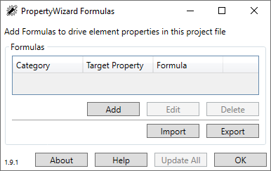

# Property Wizard Formulas

## [Find Formlulas Here](https://cridder.github.io/property-wizard-formulas/) - https://cridder.github.io/property-wizard-formulas/   

## What
This reposistory is for the AEC community to share formulas for [PropertyWizard](https://apps.autodesk.com/en/Publisher/PublisherHomepage?ID=K3XURSQAXDBW).  [PropertyWizard](https://apps.autodesk.com/en/Publisher/PublisherHomepage?ID=K3XURSQAXDBW) is created by [David Wood Design Ltd.](https://davidwooddesign.com/).  [David Wood Design Ltd.](https://davidwooddesign.com/) assumes no liability, supplies no trademark, and provides no warranty on this sites content.

## Why
Because sharing is caring.


## Who
cridder https://github.com/cridder:
- hosts this site.
- is a end user of [PropertyWizard](https://apps.autodesk.com/en/Publisher/PublisherHomepage?ID=K3XURSQAXDBW).
- pays for [PropertyWizard](https://apps.autodesk.com/en/Publisher/PublisherHomepage?ID=K3XURSQAXDBW) personally.
- does not profit (receive $) from this site.
- is not sponsored and/or associated with [David Wood Design Ltd.](https://davidwooddesign.com/).  [David Wood Design Ltd.](https://davidwooddesign.com/) other than being a customer
- cannot be held liable for any formula hosted here.
- assumes no liability, supplies no trademark, and provides no warranty on this sites content.

## Everyone
- It is the responsibility of everyone using content from this site to test any and all [PropertyWizard](https://apps.autodesk.com/en/Publisher/PublisherHomepage?ID=K3XURSQAXDBW) formulas in a nonproduction envronment.
- Everyone using content from this site assumes all liability, warranties for all content used from this site.

## How to contribute
- Learn MarkDown.
  - [Learn MarkDown on GitHub](https://docs.github.com/en/get-started/writing-on-github/getting-started-with-writing-and-formatting-on-github/basic-writing-and-formatting-syntax).
  - [Learn MarkDown on markdownquide.org](https://www.markdownguide.org/).
- Learn how to use GitHub.
  - [Get Started](https://docs.github.com/en/get-started).
- [Send a Pull Request with edits to index.md](https://docs.github.com/en/pull-requests/collaborating-with-pull-requests).
- Use a Fenced Code Block on the The Pull Request, see below

## Example Contribution Format  
Code block below should be used for formatting contribution.

```
---

## Formula
| `Category` | `Target Property` | `Formula` |
| :---: | :---: | :---: |
| EnterCategoryName | EnterParameter | EnterFormulaText |

**Description**: Sets the out of the box Mark parameter to the element id on all doors.  Eliminates any and all warning messages about duplicate Mark values.  Mark values are meant to be unique.
<br/>
**Contributor**:  NAME
<br/>
*Contact*:  CONTRIBUTORS WEB/GITHUB/LINKEDIN LINK

---
```

---

## Formula
| `Category` | `Target Property` | `Formula` |
| :---: | :---: | :---: |
| Doors | Mark | Id |

**Description**: Sets the out of the box Mark parameter to the element id on all doors.  Eliminates any and all warning messages about duplicate Mark values.  Mark values are meant to be unique.
<br/>
**Contributor**:  cridder
<br/>
**Contact**:  https://github.com/cridder https://www.linkedin.com/in/chrisridder/

---

The above format is simple and efficient.  Any user can apply enter information quickly into the [PropertyWizard](https://apps.autodesk.com/en/Publisher/PublisherHomepage?ID=K3XURSQAXDBW) dialog.  We are NOT going to share the GUID's that [PropertyWizard](https://apps.autodesk.com/en/Publisher/PublisherHomepage?ID=K3XURSQAXDBW) creates and manages for obvious reasons.



### The Future
The more people who contribute the more fancy and organized the site might become.  For now it is a good minimum viable product.

Thanks.
  